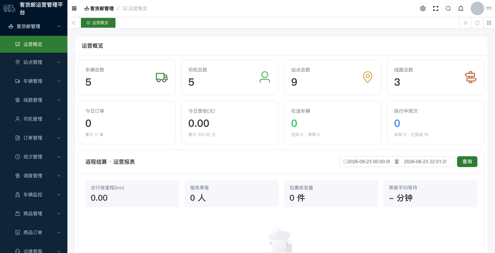
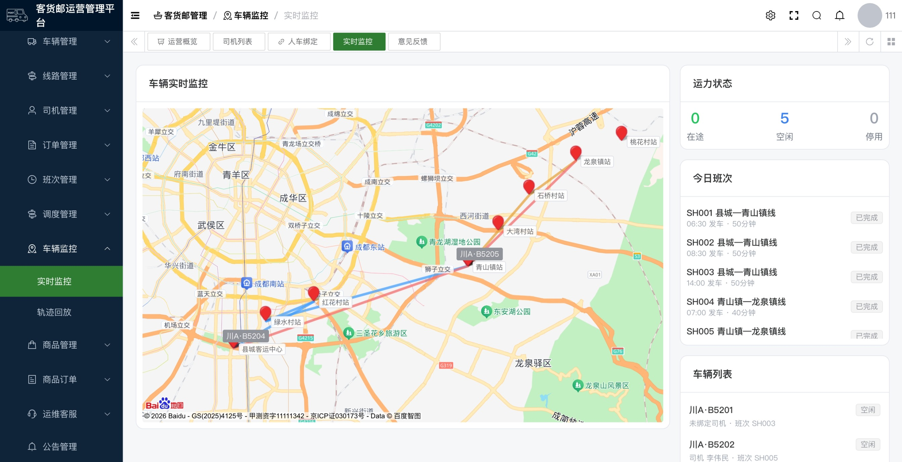
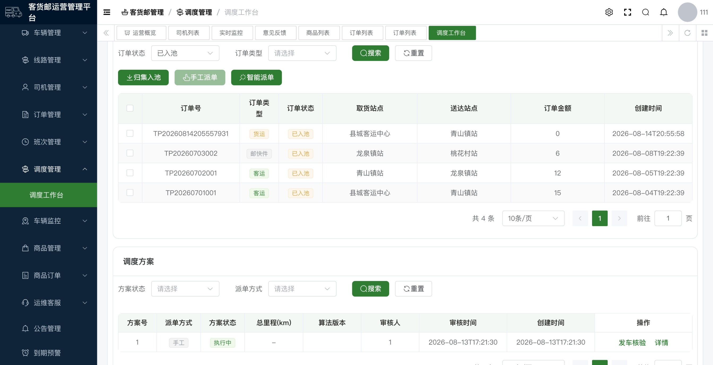
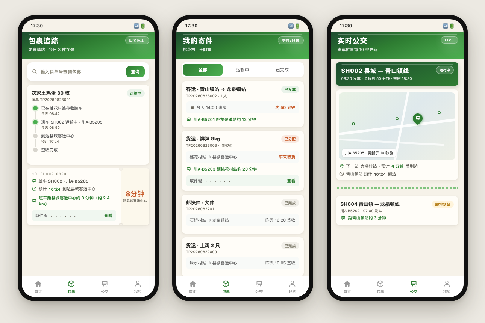

# 客货邮运营管理平台（Cargo Post Platform）

[](https://github.com/cgp-team/cargo-post-platform/actions/workflows/ci.yml)


面向县域**客运、货运、生鲜与邮快件协同运营**的一体化平台：管理端（Vue 3）+ 微信小程序（乘客/司机）+ 单体业务后端（Spring Boot）+ **自研路线规划算法服务**（OR-Tools，高德路网距离）。

覆盖完整业务闭环：村民小程序下单/寄件 → 订单归集入池 → 智能/手工派单（路线优化）→ 方案审核下发 → 司机班次执行与位置上报 → 包裹追踪与取件码核销 → 运营监控与结算估算。

## 截图

**管理端**：运营概览 · 车辆实时监控 · 调度工作台

<p>
  
  
  
</p>

**微信小程序**：首页 · 客户功能 · 司机界面



## 功能特性

- **班次调度**：预约订单池、手工/智能派单、方案审核下发、发车核验、每站 ETA 与收入/成本估算（路网时长 + 计价规则）
- **算法服务**：自研 OR-Tools 路线规划（容量/时序/闭环约束、优先单车），FastAPI 契约接口 + 高德驾车路网距离（故障自动降级直线）；适配层快照幂等、超时重试、结果校验、规模预检
- **车辆监控**：GIS 实时监控（司机上报位置优先，插值兜底）、轨迹回放、数据大盘
- **订单业务**：客运、货运/生鲜、邮快件三类订单全状态流转，货运安全审核
- **微信小程序**：「山乡巴士 · 站牌与车票」设计体系——商城下单、寄件、包裹轨迹与取件码、车来取货/送货实时提醒、实时公交、司机工作台（班次任务/装车核验/发车签收/收益）
- **运力资源**：车辆/司机档案与人车绑定、证照/保险到期预警、站点线路班次
- **基础设施**：CI 五项门禁 + dev 持续部署（self-hosted runner）、契约 Mock 与验收测试套件、分支保护

## 架构

```text
管理端 / 微信小程序 ──> Nginx ──> 单体业务后端 ──> 算法适配层 ──> 路线规划算法服务
                                  │                      （自研 OR-Tools / 契约 Mock）
                                  ├── MySQL · Redis
                                  └── 高德距离测量 API（路网距离，可选降级）
```

边界约束：前端不直连算法服务；算法服务不持有业务数据库凭据；所有调度状态变更可审计。

## 技术栈

| 端 | 技术 |
|---|---|
| 后端 | JDK 21 · Spring Boot 3.5 · Spring Security 6 · MyBatis Plus · MySQL 8.4 · Redis 7 |
| 管理端 | Vue 3 · TypeScript · Element Plus · 百度地图 GL |
| 小程序 | 微信原生小程序（仅调用 `/app-api`） |
| 算法服务 | Python 3.11 · FastAPI · OR-Tools（pywrapcp）· Docker |
| 算法 Mock | Python · FastAPI · pytest（契约 Mock / 混沌测试） |
| 基础设施 | Docker Compose · Nginx · systemd · GitHub Actions |

## 快速开始

环境要求：JDK 21 · Maven 3.9+ · Node.js 22 · pnpm · Python 3.12+ · Docker Compose v2

```bash
# 1. 基础设施（MySQL / Redis / 算法服务与契约 Mock）
cp .env.example .env      # 修改占位密码；配置 AMAP_KEY 可启用路网距离
docker compose --env-file .env -f deploy/docker-compose.yml up -d
deploy/scripts/health-check.sh

# 2. 初始化数据库（依次 SOURCE）
# sql/mysql/ruoyi-vue-pro.sql → cleanup-upstream-menus.sql → transport-schema.sql
# → transport-schema-incremental.sql → transport-menu.sql（演示数据 transport-demo-data.sql 可选）

# 3. 后端（默认 48080）
mvn -pl yudao-server -am clean test
mvn -pl yudao-server -am spring-boot:run

# 4. 管理端
cd yudao-ui/yudao-ui-admin-vue3 && pnpm install --frozen-lockfile && pnpm dev

# 5. 小程序：微信开发者工具导入 miniprogram/（开发版勾选「不校验合法域名」）
```

## 项目结构

```text
yudao-server/              单体后端启动模块（装配 system、infra、transport、member）
yudao-module-transport/    客货邮业务模块（资源/订单/调度闭环/监控大盘/商品/算法适配层）
yudao-ui/yudao-ui-admin-vue3/  管理端 Vue3 工程
miniprogram/               微信小程序（商城、寄件、包裹、实时公交 + 司机工作台）
algorithm/                 自研路线规划算法服务（FastAPI + OR-Tools，生产用）
mock-algorithm/            契约 Mock 算法服务（混沌测试用）+ 契约验收测试套件
deploy/                    Compose、Nginx 示例、运维脚本、systemd 单元
docs/                      需求、架构、契约、部署、数据库文档（索引见 docs/README.md）
sql/                       MySQL 初始化脚本与增量迁移（sql/incremental/）
```

## 文档

| 文档 | 内容 |
|---|---|
| [需求基线](docs/requirements.md) | 需求与优先级（含实现现状） |
| [架构设计](docs/architecture.md) | 总体架构、模块边界、调用约束 |
| [算法对接](docs/algorithm-integration.md) | 路线规划算法契约与自研实现说明 |
| [数据库](docs/database.md) | 数据库脚本与增量迁移 |
| [小程序](docs/miniprogram.md) | 小程序页面、登录链路、联调步骤 |
| [部署](docs/deployment.md) | 部署、CI/CD、Nginx、备份恢复 |
| [完整索引](docs/README.md) | 全部文档索引 |

## 贡献

欢迎 Issue 与 PR。协作流程（分支 + PR 评审、CI 门禁、提交规范）见 [Git 协作指南](docs/Git%20协作.md)；请勿提交真实密码、令牌、`.env` 或生产数据。

## 许可证

[MIT](LICENSE)。基于 [RuoYi-Vue-Pro](https://github.com/YunaiV/ruoyi-vue-pro)（`2026.06` / JDK 21 发布线）深度改造，上游版权与许可证说明予以保留；业务改造不代表上游项目对本平台的背书。
