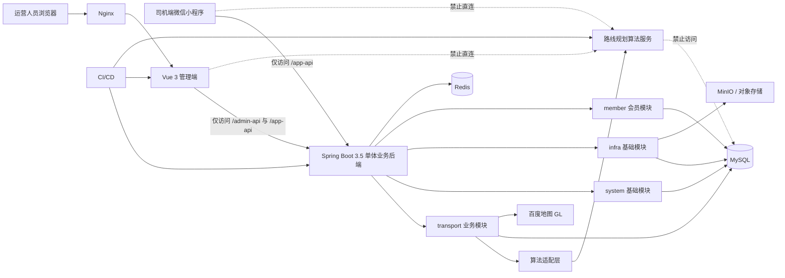

# 架构说明

平台当前采用单体后端、独立 Vue 管理端和司机端微信小程序。`transport` 承载客货邮领域逻辑，`system` 与 `infra` 保持上游基础职责，`member` 仅服务小程序登录。路线规划算法是独立服务，通过受控适配层异步调用。

Nginx 对浏览器仅暴露静态管理端、业务 API 和业务 WebSocket。算法容器不通过 Nginx 暴露，由后端网络访问。业务后端生成不可变规划快照，提交算法任务，轮询状态，校验结果引用、容量、时间窗和版本，再由人工或规则审核后写入业务库。

## 模块边界

- `transport/controller`：协议转换与权限声明，不编排复杂业务。
- `transport/service`：资源、订单、调度、监控、结算、运营用例和事务。
- `transport/dal`：业务表访问，不访问算法服务。
- `transport/integration/algorithm`：算法 DTO、客户端、超时/重试/幂等和结果校验。
- `system`：用户、角色、菜单、字典、日志与租户；不写客货邮业务。
- `infra`：文件、配置、任务等通用基础设施；不写客货邮业务。
- `member`：仅为司机端小程序提供 `/app-api/member/auth/*` 登录与用户接口（依赖 `member_user` 表）；不写客货邮业务。
